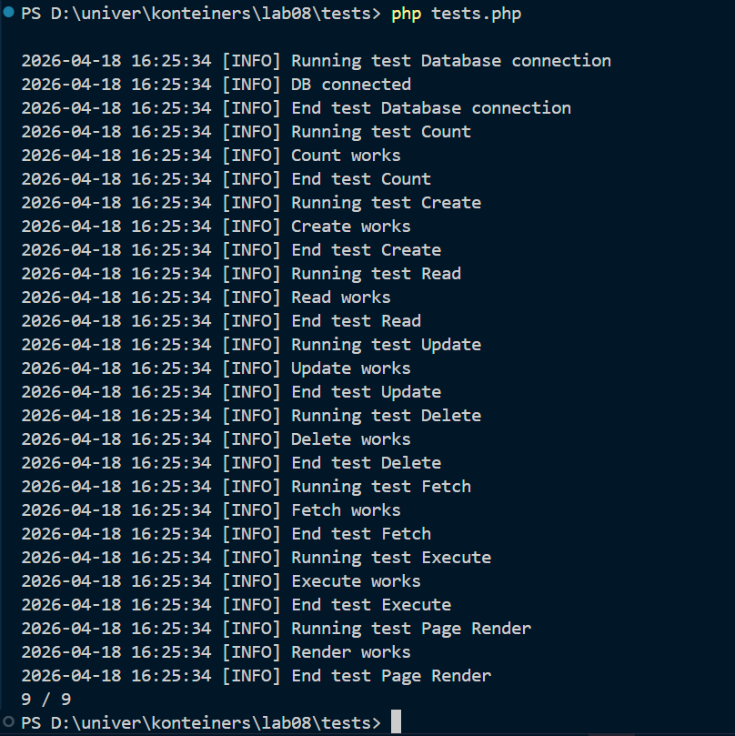
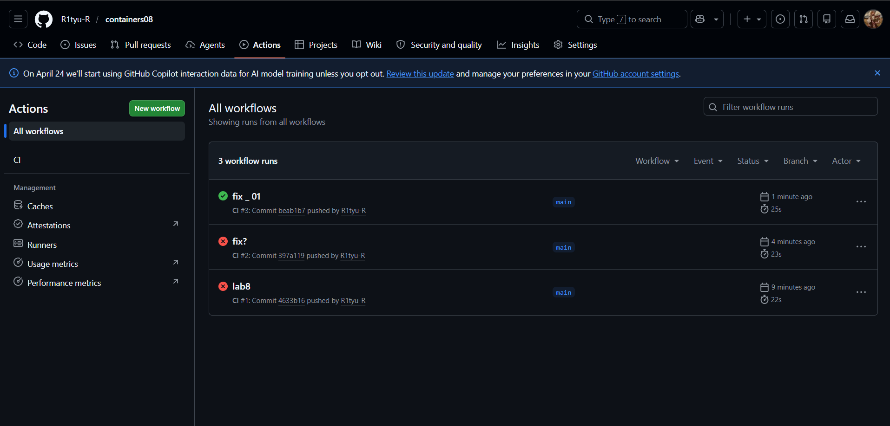

# Лабораторная работа номер 8 : Непрерывная интеграция с помощью Github Actions

## Цель работы : 
Научиться настраивать непрерывную интеграцию с помощью Github Actions 

## Ход работы 

Архитектура проекта: 
```
LAB08
├── .github/
│   └── workflows/
│       └── main.yml
├── img/
├── site/
│   ├── modules/
│   │   ├── database.php
│   │   └── page.php
│   ├── styles/
│   │   └── style.css
│   ├── templates/
│   │   └── index.tpl
│   ├── config.php
│   ├── database.db
│   └── index.php
├── sql/
│   └── schema.sql
├── tests/
│   ├── testframework.php
│   └── tests.php
├── Dockerfile
└── readme.md
```
Создав следующую архитектуру начинаем наполнять файлы содержимым. 
### modules/database.php
Начинаем с `modules/database.php` где создаем класс, со следующими методами :

- `__construct($path)` - конструктор класса, принимает путь к файлу базы данных SQLite;
- `Execute($sql)` - выполняет SQL запрос;
- `Fetch($sql)` - выполняет SQL запрос и возвращает результат в виде ассоциативного массива.
- `Create($table, $data)` - создает запись в таблице $table с данными из ассоциативного массива $data и возвращает идентификатор созданной записи;
- `Read($table, $id)` - возвращает запись из таблицы $table по идентификатору $id;
- `Update($table, $id, $data)` - обновляет запись в таблице $table по идентификатору $id данными из ассоциативного массива $data;
- `Delete($table, $id)` - удаляет запись из таблицы $table по идентификатору $id.
- `Count($table)` - возвращает количество записей в таблице $table.

В database.php - мы описываем основную логику взаимодествия с базой данных, которая в последствии будет тестироваться с помощью тесткейсов, находящихся в `tests.php`

### modules/page.php

Следующий файл, `modules/page.php` - отвечающий за вывод информации из базы данных, в виде страницы по шаблону (`index.tpl`)

Имеет следующее наполнение: 

- `__construct($template)` - конструктор класса, принимает путь к шаблону страницы;
- `Render($data)` - отображает страницу, подставляя в шаблон данные из ассоциативного массива $data.

### templates/index.tpl
Файл шаблона страницы со следующим содержимым : 
```php
<!DOCTYPE html>
<html>
<head>
    <title>{{title}}</title>
    <link rel="stylesheet" href="/styles/style.css">
</head>
<body>

<div class="container">
    <h1>{{title}}</h1>
    <p>{{content}}</p>
</div>

</body>
</html>
```

### styles/style.css

Содержит стили для страницы 
```css
body {
    margin: 0;
    padding: 0;
    font-family: 'Segoe UI', Tahoma, sans-serif;
    background: linear-gradient(135deg, #a8edea, #fed6e3);
    height: 100vh;
}
.container {
    max-width: 800px;
    margin: 80px auto;
    padding: 30px;
    background: white;
    border-radius: 16px;
    box-shadow: 0 10px 30px rgba(0,0,0,0.1);
    text-align: center;
}
h1 {
    margin-bottom: 20px;
    color: #333;
}
p {
    font-size: 18px;
    color: #555;
    line-height: 1.6;
}
```
### index.php

Данный файл является посредником между базой данных и шаблоном, обрабатывая запрос пользователя,получает данные от базы данных, после чего выводит сформированную страницу на базе шаблона.

Имеет следующее наполнение 

```php
<?php
# подключаем файлы database.php, page.php, config.php
require_once __DIR__ . '/modules/database.php';
require_once __DIR__ . '/modules/page.php';
require_once __DIR__ . '/config.php';

# создание объекта базы данных
$db = new Database($config["db"]["path"]);
# создание объекта страницы 
$page = new Page(__DIR__ . '/templates/index.tpl');
# получение параметра из url
$pageId = $_GET['page'];
# получение данных из базы 
$data = $db->Read("page", $pageId);
# генерация страницы
echo $page->Render($data);
```

### schema.sql

Создаем  `schema.sql` со следующим содержимым :

```sql
CREATE TABLE page (
    id INTEGER PRIMARY KEY AUTOINCREMENT,
    title TEXT,
    content TEXT
);

INSERT INTO page (title, content) VALUES ('Page 1', 'Content 1');
INSERT INTO page (title, content) VALUES ('Page 2', 'Content 2');
INSERT INTO page (title, content) VALUES ('Page 3', 'Content 3');
```

### Создание тестов

Создаем файл `testframework.php ` куда помещаем код, написанный нашим прекрасным преподавателем, за что мы ему благодарны, ибо нам самим не пришлось это писать)

После чего создаем `tests.php` где, используя шаблон, предоставленный нам, дописываем тесты, для проверки корректности работы наших методов, в классе, реализовывающем основную логику взаимодействия с бд. 

### Создание Dockerfile 

После всех наших скитаний от одного файла к другому, мы наконец приближаемся к окончанию, создаем dockerfile, со следующим содержимым : 
```dockerfile
# базовый образ 
FROM php:7.4-fpm as base
# обновляем пакеты и устанавливаем sqlite и libsqlite3-dev (библиотека, необходимая для разработки)
RUN apt-get update && \
    apt-get install -y sqlite3 libsqlite3-dev && \
    # включаем расширение что ыб php мог работать с sqlite через pdo 
    docker-php-ext-install pdo_sqlite

# хранилище данных
VOLUME ["/var/www/db"]
# копируем схему с хоста, внутрь образа  
COPY sql/schema.sql /var/www/db/schema.sql

RUN echo "prepare database" && \
    #считывает данные из schema.sql и передает их в sqlite, после чего выполняет их 
    cat /var/www/db/schema.sql | sqlite3 /var/www/db/db.sqlite && \
    #максимальные права 
    chmod 777 /var/www/db/db.sqlite && \
    #удаляем файл схемы 
    rm -rf /var/www/db/schema.sql && \
    echo "database is ready"
# копируем папку с хоста, внутрь образа
COPY site /var/www/html

```
## Настройка github Actions 

Создаем следующий файл : `.github/workflows/main.yml`

```yml
name: CI
#когда запускается, в нашем случае при push в ветку main 
on:
  push:
    branches:
      - main
#  создаем задачу build, после чего создается временная ВМ, на базе ubuntu 
jobs:
  build:
    runs-on: ubuntu-latest
    # указываем последовательность действий, для выполнения 
    steps:
      - name: Checkout # клонирует содержимое моего репозитория в рабочую папку 
        uses: actions/checkout@v4
      - name: Build the Docker image # сборка образа 
        run: docker build -t containers08 .
      - name: Create `container` # создание контейнера на базе образа
        run: docker create --name container --volume database:/var/www/db containers08
      - name: Copy project to the container # копирование всего проекта внутрь контейнера 
        run: docker cp . container:/var/www/html
      - name: Up the container # запуск контейнера 
        run: docker start container
      - name: Run tests # запуск тестов
        run: docker exec container php /var/www/html/tests/tests.php
      - name: Stop the container # остановка контейнера
        run: docker stop container
      - name: Remove the container # удаление контейнера 
        run: docker rm container
```

Перед тем, как пушить на гитхаб, я локально решила протестировать корректность работы тестов, возникли некоторые ошибки, которы были с успехом решены, вот одна из проблем: 
`2026-04-18 16:00:34 [ERROR] Exception: could not find driver`
не было включено расширение pdo_sqlite. Пришлось искать файл php.ini b раскоментировать там следующие строки 
```
extension=pdo_sqlite
extension=sqlite3
```

после чего : 


### Запуск и тестирование

Закидываем на репозиторий проект и переходим во вкладку Actions. К сожалению, или к счастью, все удачно запустилось и прошло тесты всего с 3 раза) 

Причина первых двух провалов была : 
- изначальное неверное копирование файлов внутрь контейнера, из за чего отсутствовали необходимые файлы

Но, с 3 раза все заработало и ваша покорная слуга, под лучи заходящего солнца и, будучи преисполнена радости, пошла прогуливаться под осенним дождем с собакой...




### Вопросы 

- Что такое непрерывная интеграция?
    - Это процесс автоматической сборки и проверки проекта при каждом изменении кода, происходящий без участия пользователя
- Для чего нужны юнит-тесты? Как часто их нужно запускать?
    - Юнит тесты необходимы для тестирования корректности работы функций и методов, классов, изолированно от остальных частей программы. необходимо запускать при каждом серьёзном изменении данных
- Что нужно изменить, чтобы тесты запускались при Pull Request?
    - 
    ```yml
        on:
    push:
        branches:
            -main
    pull_request:

    ```
- Что добавить для удаления образов после тестов?
    - `docker rmi containers08`

## Библиография 
- [Класс Pdo\Sqlite](https://www.php.net/manual/ru/class.pdo-sqlite.php)
- [moodle](https://elearning.usm.md/mod/lesson/view.php?id=286356&pageid=3124)
